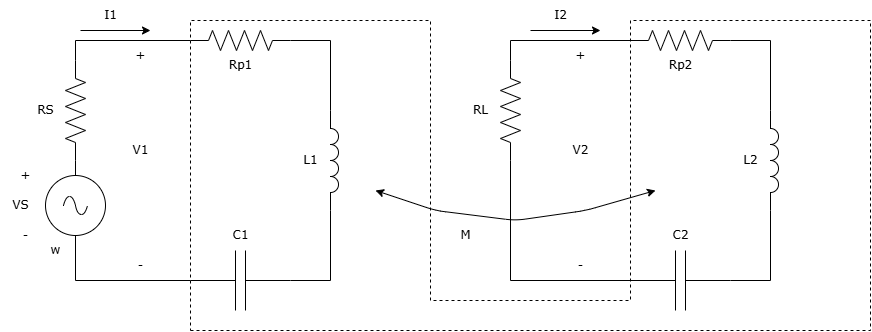

# WPT Paramter Search 2

## 概要

### 一般論：多変数関数の逆問題

いくつかの変数をもつ関数$f$が具体的な形で与えられているとする。
$$y=f(x_1, x_2, x_3, \ldots )=x_1^2 + x_2 x_3 + \cdots$$
変数が具体的な値をもつとき，関数の値がどうなるかは単純に代入するだけで答えがわかる。
$$y=f(2,1,\tfrac{3}{7},\ldots )=2^2 + 1\cdot \tfrac{3}{7} + \cdots$$
しかし逆に，関数が指定した値をとるのは，変数がどのような値をもつときなのかを知ることは難しく，可能かどうかも一般にはわからない。
$$\tfrac{1}{2} = f(x_1, x_2, x_3, \ldots )=x_1^2 + x_2 x_3 + \cdots
\quad \Rightarrow \quad
x_1=?,\ x_2=?,\ x_3=?,\ldots$$

### WPTにおける逆問題

無線電力伝送の標準的な回路において，負荷が受け取る平均電力$P$は次のように表される。
$$P=\frac{R_{L} V_{S}^{2}}{8 R_{1} R_{2}}P_N$$
$$P_N=\frac{4 k^{2} R_{1} R_{2} L_{1} L_{2} \omega^{2}}{\left(R_{1} R_{2} + \left(\omega L_{1} - \frac{1}{\omega C_{1}}\right)\left(\omega L_{2} - \frac{1}{\omega C_{2}}\right) - \omega^{2} k^{2} L_{1} L_{2}\right)^{2} + \left(R_{1}\left(\omega L_{2} - \frac{1}{\omega C_{2}}\right) - R_{2}\left(\omega L_{1} - \frac{1}{\omega C_{1}}\right)\right)^{2} + 4 k^{2} R_{1} R_{2} L_{1} L_{2} \omega^{2}}$$
ただし，$V_S$は理想電圧源の電圧の振幅であり，$R_1=R_S+R_{p1}$, $R_2=R_L+R_{p2}$とおいた。$R_S$などの素子の定数，角周波数$\omega$はすべて正の実数である。また結合係数$k$は$0 < k^2 < 1$を満たす値をとりうる。このとき，$P_N$は必ず$0 < P_N \leqq 1$の値をとる。この$P_N$を正規化電力という。$P_N$は
$$R_1,R_2,L_1,L_2,C_1,C_2,k,\omega$$
を変数とする８変数関数である。
負荷が受け取る平均電力を大きくしたい，つまりたとえば

- $0.9\leqq P_N\leqq 1$

となるような変数の値を知りたい。

### 現実的制約（部品・周波数など）

現実的には，

- 用いる電源は決まっていて内部抵抗をすでに求めている
- 電源が正弦波交流電圧を出せる周波数$f$には限界がある
- 負荷の抵抗値は手元にあるものを直並列接続で作りたい
- コイルはすでに巻きおわっていて，それを利用したい
- コンデンサは在庫の中から選びたい

など，得たい電力以外の希望があるだろう。そこで解きたい問題は，$0.9\leqq P_N\leqq 1$だけでなく，次のような条件を満たす変数の値を知りたいということになる。

- $R_1=1.0$ $\Omega$
- $10.0$ kHz $\leqq f = \tfrac{\omega}{2\pi} \leqq$ $100.0$ kHz
- $R_2=10.0$ $\Omega$
- $L_1=140.0$ $\mu$ H
- $L_2=130.0$ $\mu$ H
- $1.0$ nF $\leqq C_1 \leqq$ $100.0$ nF
- $1.0$ nF $\leqq C_2 \leqq$ $100.0$ nF

### 探索

問題の答えを見つけるもっとも単純な方法は，変数１つ１つについて，与えられた範囲から１つ値を選んで，関数に代入し，その結果が指定した範囲に入っているかを判定することである。これを多数繰り返せばよいだろう。ただし，いくら繰り返しても正解に到達できない場合もある（そもそも正解が存在しない場合と，繰り返し回数が少なくて正解に到達できなかった場合とがある）。そのような状況を事前に知ることができればよいが，無線電力伝送の平均電力の式においてはなかなか難しい。

したがって，「変数の値を１つ選び，代入し，判定する」という繰り返しを一定回数行い，正解が含まれていれば目的を達成，含まれていなければ別の範囲を設定しなおして再計算するということになる。この場合，繰り返し回数を多くしたいが，正解が存在しないこともあるので，正解が存在する，しないにかかわらず，とにかく短時間で結果を得たい。

そこでプログラム開発にはgo言語を用いる。四則演算，判定などの基本的な処理速度は，C言語と同等とのことである。体感的には，コンパイルをかけたPythonの10倍，普通のPythonやWolframの100倍高速である。

## コード

### ユーザーがコード中に記述（`config.go`）

- 関数の具体的定義式とその引数
- 各引数について，引数の値の範囲
- 各引数について，引数の値の範囲から値を線形的な分点で選ぶのか，対数的な分点で選ぶのかの別
- 関数の値の範囲
- 繰り返し回数
- 引数の値，関数の値が指定した範囲に入ったときの引数と関数の値（正解）
- 保存する正解の数
- 引数の値，関数の値が指定した範囲に入らなかったときの引数と関数の値（不正解）
- 保存する不正解の数
- エクセルファイルに保存したい場合はファイル名を指定

### 出力（コンソール表示）

- 保存した正解リスト
- 保存した不正解リスト
- Ctrl-Cで終了した場合はその時点における保存した正解リスト，不正解リスト

### 終了条件

- 繰り返し回数に到達
- Ctrl-C

### アルゴリズム

以下を終了条件を満たすまで繰り返す。進行状況確認用に正解数，不正解数カウンターを表示

- 線形分点指定の引数については，範囲中から線形的に一様乱数によって値を選ぶ
- 対数分点指定の引数については，範囲中から対数的に一様乱数によって値を選ぶ
- 選んだ引数の値で関数の値を計算
- 関数の値が範囲に入っていれば正解リストに追加。
- 関数の値が範囲に入っていなければ不正解リストに追加

## 使用方法

- `git`をインストールしておく
- `go`言語をインストールしておく
- コマンドプロンプトやpowershellで`git clone https://github.com/ichijohodaka/wpt-parameter-search2.git`
- `wpt-parameter-search2`フォルダに`cd`して，`go run .`
- 「ユーザー設定（ここから）」から「ユーザー設定（ここまで）」の間のコードを適宜書き換え

